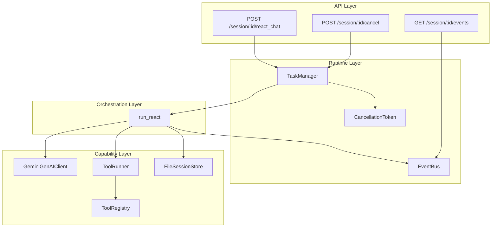
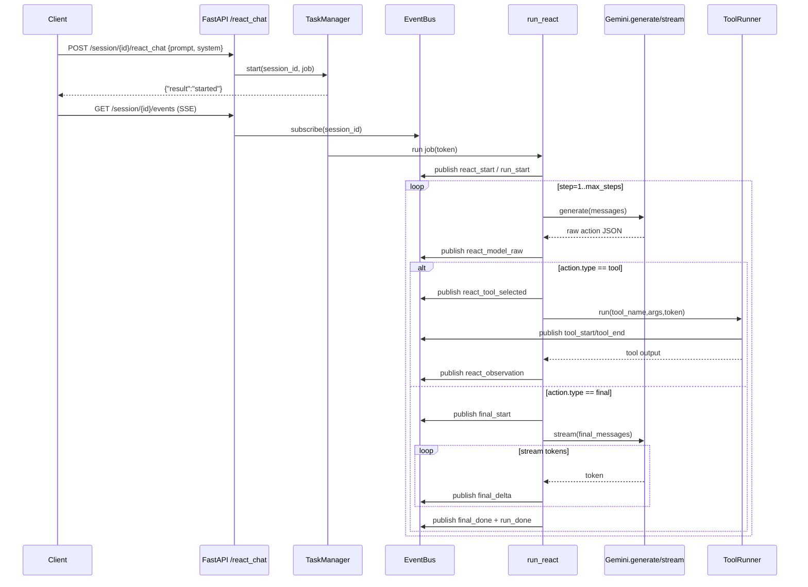

# Agentlab Architecture(v0.1)
## goal
Agentlab is a event-drived agent service (FastAPI+SSE) that runs a cancelable ReACT loop with tool governance(timeout/retry) and basic tracing.

## system layer
### API layer
- FastAPI routes: start task:("/react_chat","/chat")
- streaming output via SSE ("/session/{session_id}/events)
- optional Websocket
#### Responsibilities:
- accept requests
- launch corountine task（accept http request without blocking app.py）
- provide unified event stream to clients: In AgentLab, all runtime signals — agent steps, tool execution, streaming tokens, errors, and cancellations — are normalized into a single session-scoped event stream via an EventBus, and delivered to clients through a unified SSE endpoint.  This decouples agent execution from presentation, and makes observability and UI integration trivial.
### Runtime layer
Core building blocks:
- CancellationToken: define checkpoint and cancel function
- EventBus: session-scoped event queue, define publish and subscribe function
- TaskManager：one background task per session; start/cancel/status
- Storage:  save the session history

#### Responsibilities
- checkpoint cancel can help coroutine to finish safely after leaving the recored log.
- cancel function tell asyncio to stop (if there is a asyncio task await)
- Event delievery(SSE/Websocket)
- Save and load history

### Orchestration Layer
#### ReAct Loop(run_react):
- Build system prompt(tool list + strict JSON protocol)
- For each step: LLM generates action JSON
-  If action=tool: run tool; append Observation; continue
- If action=final: stream final answer and end
#### Responsibilities
- agent loop correctness(plan/act/observe/stop)
- Enforce action protocol & step bounds
### Capability Layer
- LLM client: Gemini (generate/stream)
- Tooling: ToolRegistry + ToolRunner (timeout/retry/events)
- Memory: FileSessionStore for session message history

Responsibilities:
- Provide external capabilities (LLM, tools, memory)
- Ensure tool execution is governed (timeout/retry)

![[Pasted image 20260128000041.png]]
## Event Schema (common fields)

All events are JSON objects published via `EventBus.publish(session_id, event)` and consumed via SSE `/session/{session_id}/events`. `EventBus` may attach `trace_id` and `span_id` automatically when tracing is active.

|Field|Type|Required|Meaning|
|---|---|---|---|
|`type`|string|✅|Event type (the “topic”)|
|`trace_id`|string|optional|OpenTelemetry trace id (hex)|
|`span_id`|string|optional|OpenTelemetry span id (hex)|

---

## Runtime Event Stream Table (recommended)

### A) Request / Run lifecycle (API / job wrapper)

|`type`|Emitted by|When|Key fields|Example|
|---|---|---|---|---|
|`react_user_input`|API (`/react_chat`)|user submits prompt|`prompt`, `system`|`{"type":"react_user_input","prompt":"...","system":"..."}`|
|`run_start`|API job|background task starts|`kind`|`{"type":"run_start","kind":"react_chat"}`|
|`run_done`|API job|background task finishes normally|`kind`|`{"type":"run_done","kind":"react_chat"}`|
|`error`|API job|uncaught error in job|`kind`, `error`|`{"type":"error","kind":"react_chat","error":"..."}`|
|`cancelled`|API job|job cancelled (user stop)|`kind`|`{"type":"cancelled","kind":"react_chat"}`|
|`cancel_called`|API (`/cancel`)|cancel endpoint hit|_(none)_|`{"type":"cancel_called"}`|

(These are in `agentlab.app`).

---

### B) ReAct loop (agent orchestration)

|`type`|Emitted by|When|Key fields|Example|
|---|---|---|---|---|
|`react_start`|`run_react`|loop begins|`max_steps`|`{"type":"react_start","max_steps":6}`|
|`react_step_start`|`run_react`|each step begins|`step`|`{"type":"react_step_start","step":1}`|
|`react_model_raw`|`run_react`|after LLM returns raw action|`step`, `text`|`{"type":"react_model_raw","step":1,"text":"{...}"}`|
|`react_parse_error`|`run_react`|LLM output not parseable JSON|`step`, `error`|`{"type":"react_parse_error","step":1,"error":"Cannot find JSON..."}`|
|`react_tool_selected`|`run_react`|action.type==tool|`step`, `tool`, `args`|`{"type":"react_tool_selected","step":1,"tool":"calc","args":{...}}`|
|`react_observation`|`run_react`|tool result (ok or fail) appended|`step`, `observation`|`{"type":"react_observation","step":1,"observation":{"ok":true,...}}`|
|`react_done`|`run_react`|loop ends with final|`step`|`{"type":"react_done","step":3}`|

(These are in `agentlab.orchestration.react_loop`).

---

### C) Tool execution (governance: timeout/retry + telemetry)

|`type`|Emitted by|When|Key fields|Example|
|---|---|---|---|---|
|`tool_start`|`ToolRunner`|before calling tool|`tool`, `args`, `timeout_s`, `max_retries`|`{"type":"tool_start","tool":"sleep","args":{"seconds":2},"timeout_s":5,"max_retries":0}`|
|`tool_end`|`ToolRunner`|tool succeeded|`tool`, `attempt`, `duration_ms`, `ok`|`{"type":"tool_end","tool":"sleep","attempt":1,"duration_ms":2010,"ok":true}`|
|`tool_error`|`ToolRunner`|one attempt failed|`tool`, `attempt`, `error`|`{"type":"tool_error","tool":"sleep","attempt":1,"error":"TimeoutError(...)"}`|
|`tool_cancelled`|`ToolRunner`|cancelled during tool run|`tool`, `attempt`|`{"type":"tool_cancelled","tool":"sleep","attempt":1}`|
|`tool_call_done`|API wrapper (`/tool/...`)|manual tool endpoint completes|`tool`, `output`|`{"type":"tool_call_done","tool":"calc","output":{...}}`|
|`tool_call_failed`|API wrapper (`/tool/...`)|manual tool endpoint fails|`tool`, `error`|`{"type":"tool_call_failed","tool":"calc","error":"..."}`|

(ToolRunner events are in `agentlab.tools.registry`, manual wrapper in `agentlab.app`).

---

### D) Final answer streaming (product UX)

|`type`|Emitted by|When|Key fields|Example|
|---|---|---|---|---|
|`final_start`|`stream_final_answer`|before streaming final|_(none)_|`{"type":"final_start"}`|
|`final_delta`|`stream_final_answer`|for each streamed chunk|`text`|`{"type":"final_delta","text":"你好"}`|
|`final_done`|`stream_final_answer`|after streaming ends|_(none)_|`{"type":"final_done"}`|
|`final`|API job (`/react_chat`)|send final full text once|`text`|`{"type":"final","text":"完整答案..."}`|

(`final_*` are in `react_loop`, `final` in `app.py`).

---

### E) SSE transport wrapper (how events are delivered)

Your SSE endpoint wraps _every_ internal event as:

- SSE `event`: `"runtime"`
    
- SSE `data`: JSON string of the internal event object
    
- SSE `id`: `time.time_ns()` (monotonic-ish unique id)